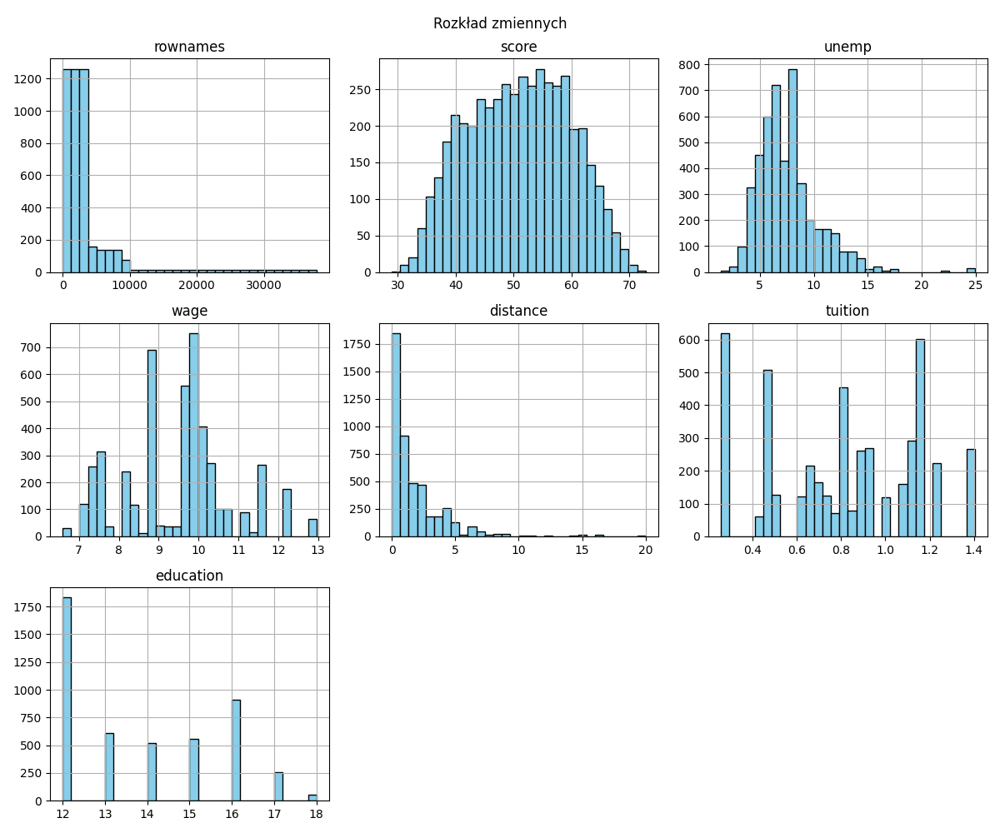
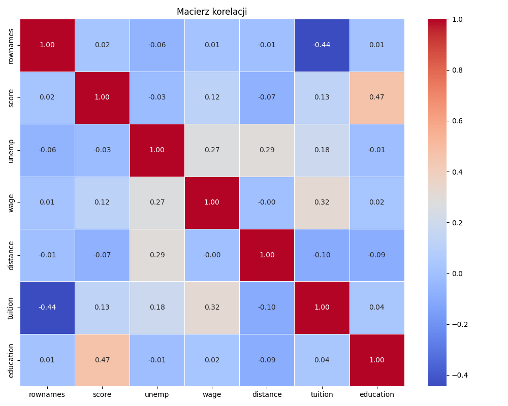
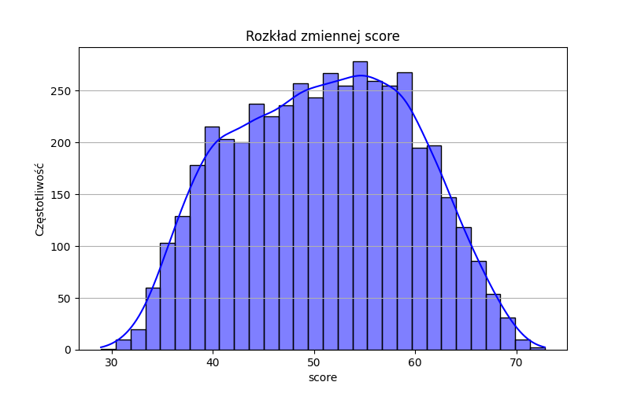
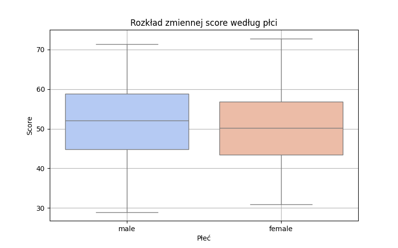
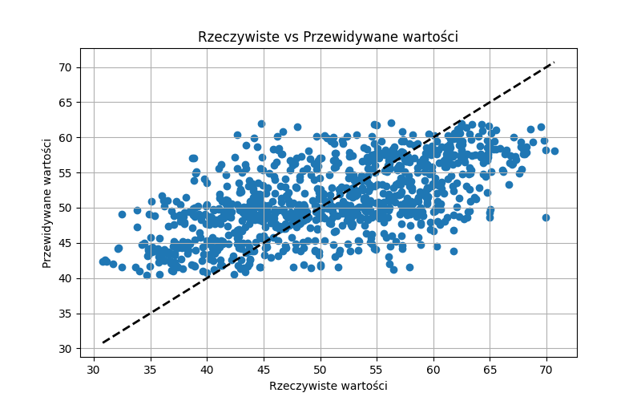
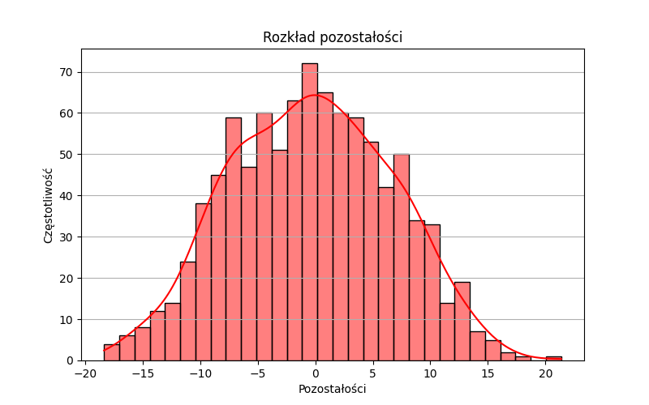

# Raport z analizy danych o college'ach

## Wprowadzenie
Celem tej analizy jest badanie danych o college'ach i prognozowanie wyników na podstawie różnych czynników.

## Analiza danych
Calkowita liczba rekordow: 4739
Brakujace wartosci: {'rownames': 0, 'gender': 0, 'ethnicity': 0, 'score': 0, 'fcollege': 0, 'mcollege': 0, 'home': 0, 'urban': 0, 'unemp': 0, 'wage': 0, 'distance': 0, 'tuition': 0, 'education': 0, 'income': 0, 'region': 0}

Procent brakujacych danych:
rownames     0.0
gender       0.0
ethnicity    0.0
score        0.0
fcollege     0.0
mcollege     0.0
home         0.0
urban        0.0
unemp        0.0
wage         0.0
distance     0.0
tuition      0.0
education    0.0
income       0.0
region       0.0
dtype: float64

### Statystyki opisowe:
           rownames        score  ...      tuition    education
count   4739.000000  4739.000000  ...  4739.000000  4739.000000
mean    3954.638953    50.889029  ...     0.814608    13.807765
std     5953.827761     8.701910  ...     0.339504     1.789107
min        1.000000    28.950001  ...     0.257510    12.000000
25%     1185.500000    43.924999  ...     0.484990    12.000000
50%     2370.000000    51.189999  ...     0.824480    13.000000
75%     3554.500000    57.769999  ...     1.127020    16.000000
max    37810.000000    72.809998  ...     1.404160    18.000000

[8 rows x 7 columns]

## Wizualizacje
- Rozklad zmiennych: 
- Macierz korelacji: 
- Rozkład zmiennej score: 
- Rozkład score według płci: 
- Rzeczywiste vs Przewidywane wartości: 
- Rozkład pozostałości: 

## Model
Sredni blad kwadratowy (MSE): 49.04
Wspolczynnik determinacji R²: 0.35
Sredni blad absolutny (MAE): 5.75

## Wnioski
Wnioski oparte na wynikach modelu mogą być dodane tutaj.
